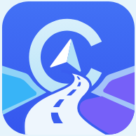
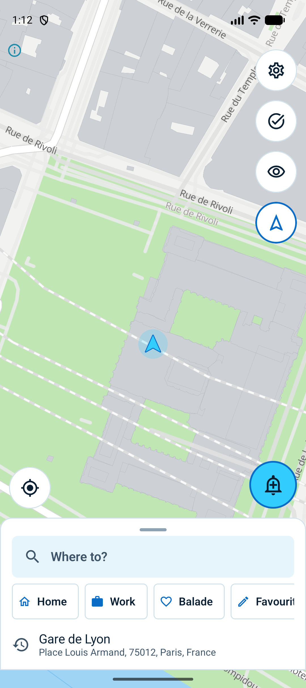
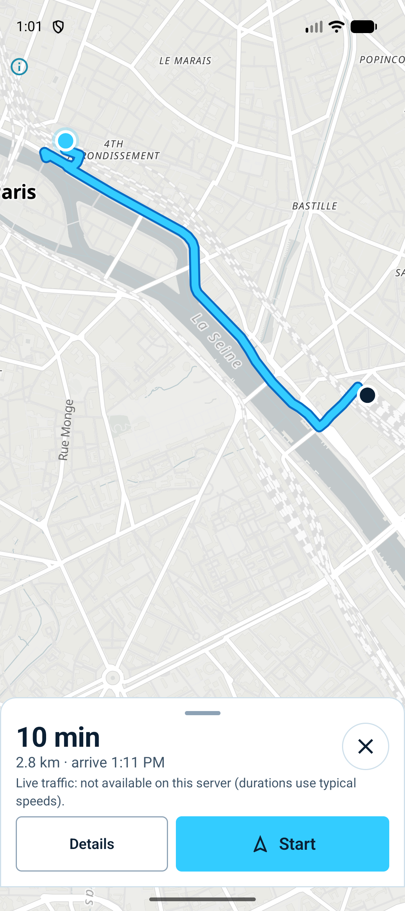
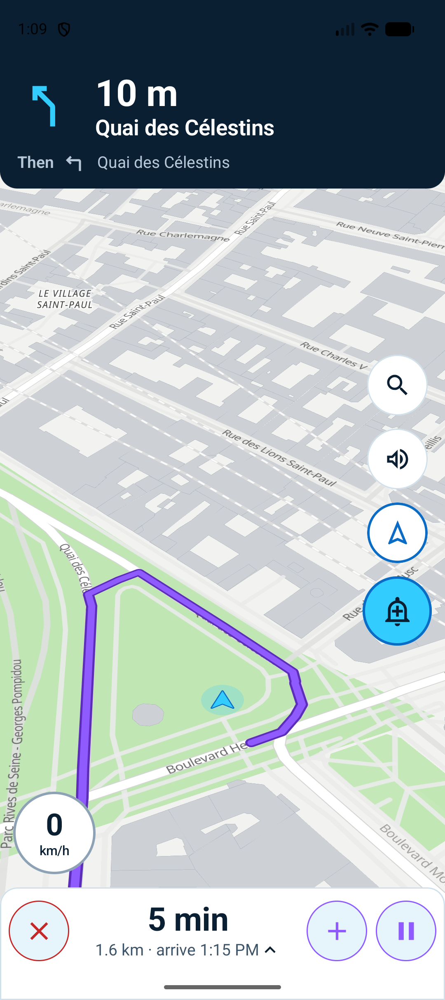
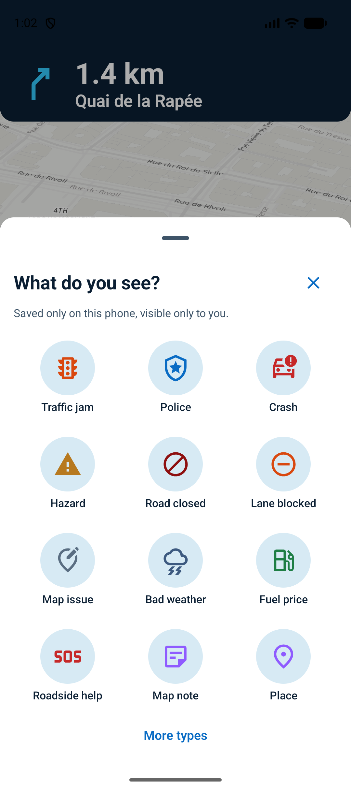
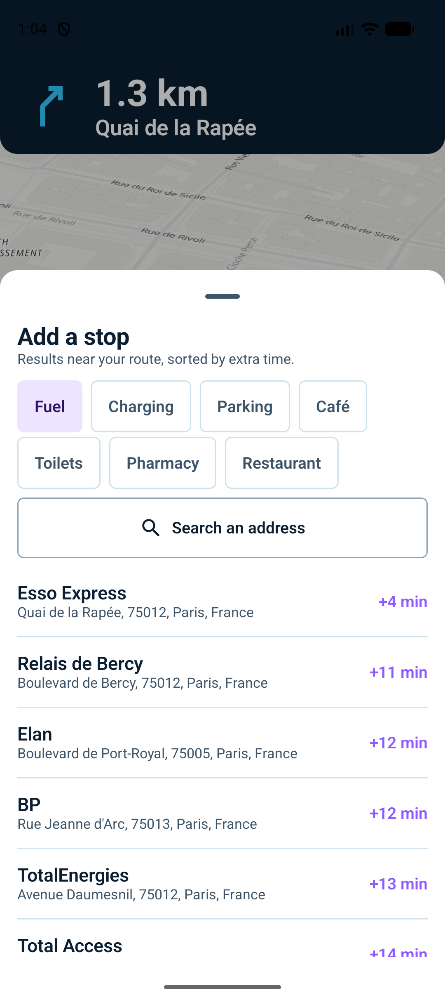
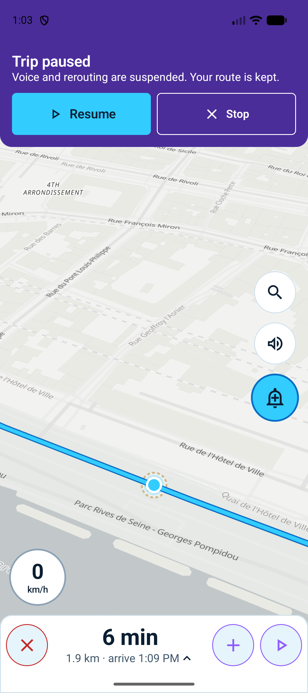
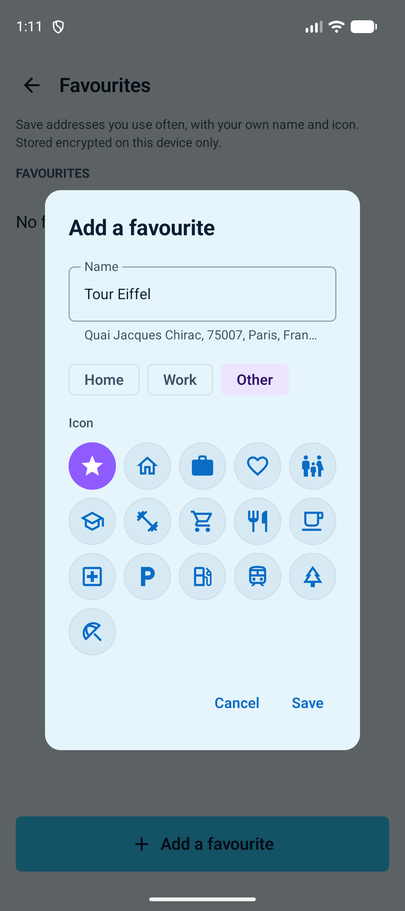
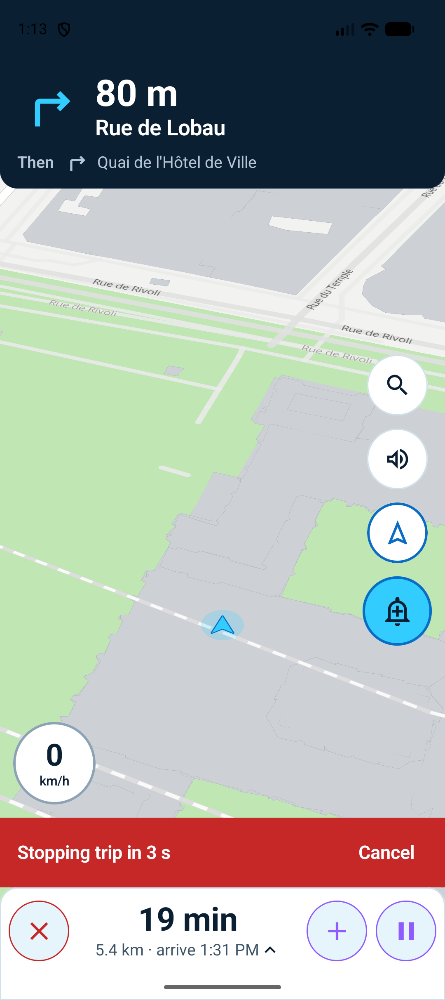

**EN DEV ACTIF**
*Peut contenir des bugs*


# Cap — GPS libre, privé par conception

Application de navigation Android **open source** (GPL-3.0-or-later) inspirée de l'ergonomie de Waze, **sans compte, sans pistage, sans publicité et sans Google Play Services**. Les alertes que vous signalez restent **uniquement sur votre téléphone**, chiffrées, et ne sont jamais partagées.

> Projet indépendant, sans lien avec Waze ou Google. Le guidage peut se tromper : respectez toujours la signalisation.

| Carte | Prévisualisation | Navigation | « Que voyez-vous ? » |
|---|---|---|---|
|  |  |  |  |

| Ajout d'arrêt (détour) | Pause | Favori personnalisé | Arrêt annulable |
|---|---|---|---|
|  |  |  |  |

## Ce qui fonctionne (v0.1.0)

- **Carte vectorielle MapLibre** (OpenStreetMap via OpenFreeMap) : eau en bleu, espaces verts en vert, bâtiments en gris, thème jour/nuit automatique, attribution ODbL visible.
- **Position GNSS native et précise** (`LocationManager` haute précision, aucune dépendance Google ; les positions réseau imprécises sont écartées tant que le GPS est frais ; bandeau si seule la position approximative est autorisée ou si le GPS est coupé), curseur bleu orienté dans le sens de déplacement, **bouton de recalibrage** (appui : carte orientée dans le sens de marche ; appui long : nord en haut).
- **Vue réglable** : vue plate de dessus par défaut, zoom rapproché sur le curseur ; zoom et inclinaison réglables dans les paramètres (avec retour aux valeurs par défaut), pincement en navigation mémorisé.
- **Langue** : sélecteur Français / English en haut des paramètres ; réglages appliqués via un bouton « Enregistrer » toujours accessible ; son activable depuis l’accueil.
- **Recherche** avec autocomplétion (Photon), biais géographique arrondi à ~1 km, coordonnées saisies résolues localement, catégories (carburant, recharge, parking…), historique.
- **Favoris** Maison / Travail / personnalisés, avec **nom et icône au choix** (16 icônes), chiffrés sur l'appareil.
- **Prévisualisation du trajet** : point de départ = position actuelle par défaut, ou n'importe quel lieu recherché ; jusqu'à 3 itinéraires (Valhalla), durée, distance, heure d'arrivée, péages/autoroute/ferry, liste des manœuvres, étapes réordonnables, options (éviter péages/autoroutes/ferries/non goudronné, profil véhicule).
- **Navigation virage par virage** : bandeau de manœuvre + « Puis… », voix locale (TTS de l'appareil), map-matching, recalcul sur déviation avec hystérésis (3 positions hors trajet), service de premier plan avec notification Pause/Arrêter.
- **Proposition de déviation** : si votre vitesse observée révèle un ralentissement devant, Cap demande un itinéraire qui évite le tronçon et le propose (jamais imposé) s'il fait gagner plus de 2 min et plus de 8 % ; l'heure d'arrivée est corrigée d'après votre allure réelle.
- **Ajout d'un arrêt en route** avec **détour estimé en minutes** (matrice Valhalla), suppression/saut d'étape.
- **Pause / reprise / arrêt** : la pause survit à la fermeture forcée de l'app ; l'arrêt est annulable 4 s puis affiche un résumé (durée réelle vs estimée, distance).
- **Alertes personnelles** : feuille « Que voyez-vous ? » (12 catégories, création en 2 appuis, sous-types facultatifs), anti-doublon à 30 m (fusionner / créer quand même), marqueurs à **opacité réduite permanente** (réglable 20–70 %) à contour pointillé, regroupement en zoom éloigné, **rappel d'approche** unique par trajet, suppression annulable 5 s, écran « Mes alertes » (tri, filtres, recherche, sélection multiple, suppression par type / totale), **export/import chiffrés par mot de passe**, envoi **manuel** d'une note à OpenStreetMap avec aperçu exact.
- **Assistance** : appel du 112, envoi de sa position par SMS à un proche, avertissement clair.
- **Règles légales par pays** (`data/legal/rules.json`) : radars désactivés là où c'est interdit.
- **Tableau de bord Vie privée** : ce qui reste sur l'appareil, ce qui en sort et vers quel serveur, **journal réseau** agrégé (sans URL ni coordonnées), « Tout effacer » (destruction de la clé de chiffrement).
- FR / EN, thème clair/sombre/contraste élevé, palette trafic daltonien, zones tactiles ≥ 56 dp.

## Ce qui n'est pas encore fait

Le cahier des charges complet (backend auto-hébergé, trafic DATEX II, hors ligne, k-anonymat, Android Auto…) est un projet de plusieurs mois. L'état précis, phase par phase, est dans [docs/ROADMAP.md](docs/ROADMAP.md). En résumé : pas de flux de trafic en direct (la détection de bouchons repose sur votre propre vitesse), pas de mode hors ligne, pas de limitations de vitesse, pas de reconnaissance vocale, serveurs publics de démonstration par défaut.

## Installer

Téléchargez `Cap-0.1.0.apk` depuis la page [Releases](https://github.com/0x80070006/cap/releases) et vérifiez l'empreinte SHA-256 publiée avec.

## Compiler

Prérequis : JDK 17+ (le JBR d'Android Studio convient), Android SDK (plateforme 37, build-tools 36).

```bash
./gradlew :app:testDebugUnitTest :app:assembleDebug
```

APK : `app/build/outputs/apk/debug/app-debug.apk`. La signature de release lit `~/.cap-signing/signing.properties` (ou `CAP_SIGNING_PROPERTIES`) — jamais dans le dépôt.

## Serveurs

Par défaut : Valhalla public de FOSSGIS (`valhalla1.openstreetmap.de`), Photon de komoot, tuiles OpenFreeMap. Ce sont des **services de démonstration** à usage raisonnable ; pour un usage intensif ou privé, auto-hébergez-les ([docs/SELF_HOSTING.md](docs/SELF_HOSTING.md)) et changez les adresses dans Paramètres → Serveurs.

## Documentation

[Architecture](docs/ARCHITECTURE.md) · [Décisions (ADR)](docs/DECISIONS.md) · [Vie privée](docs/PRIVACY.md) · [Modèle de menace](docs/THREAT_MODEL.md) · [Sources de données](docs/DATA_SOURCES.md) · [Dépendances](docs/DEPENDENCIES.md) · [Licences](docs/LICENSES.md) · [Feuille de route](docs/ROADMAP.md) · [Sécurité](SECURITY.md) · [Contribuer](CONTRIBUTING.md)

## Licence

Application : GPL-3.0-or-later. Données cartographiques © contributeurs OpenStreetMap (ODbL).
